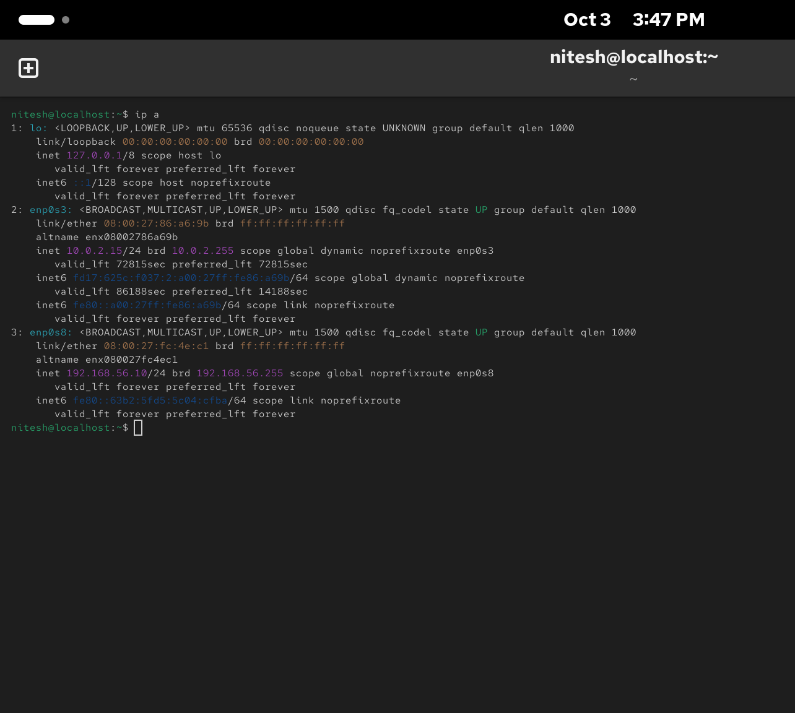
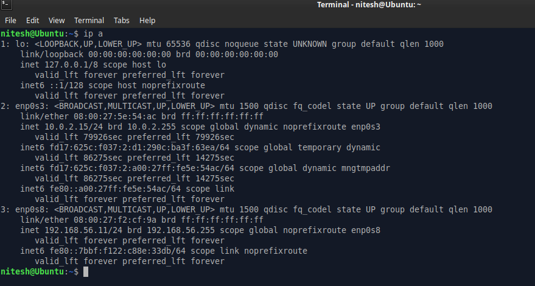
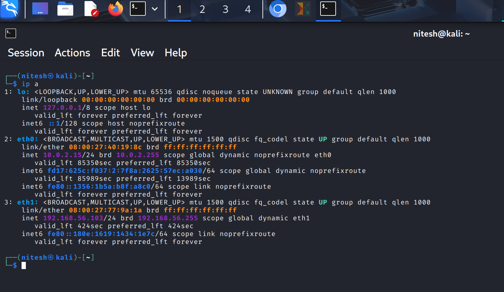
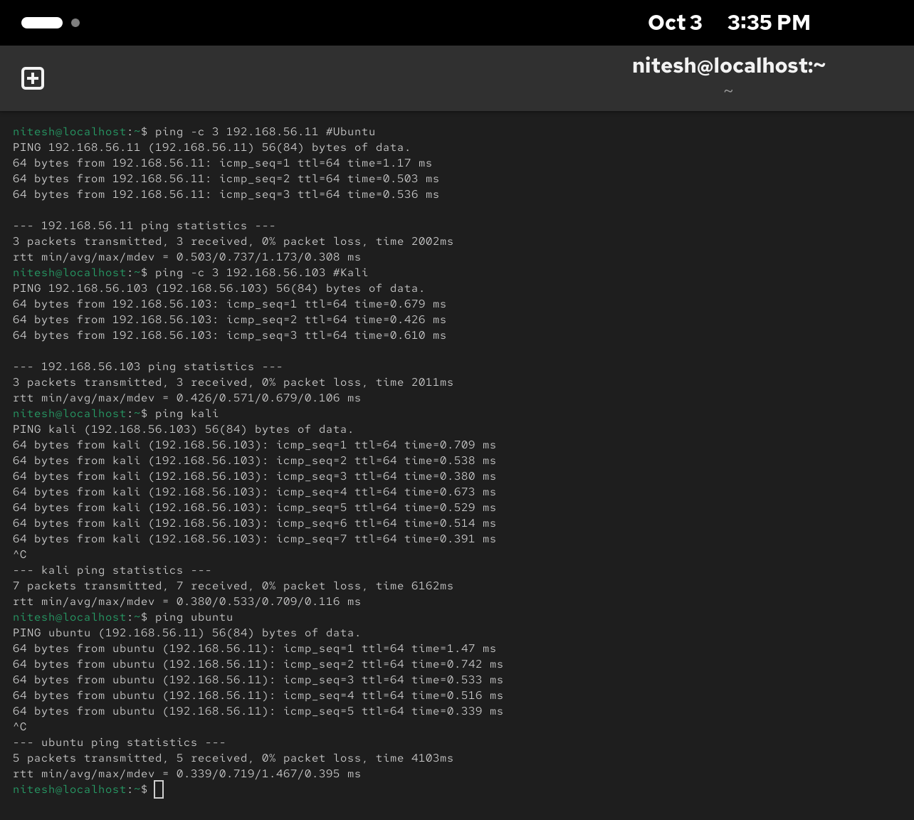
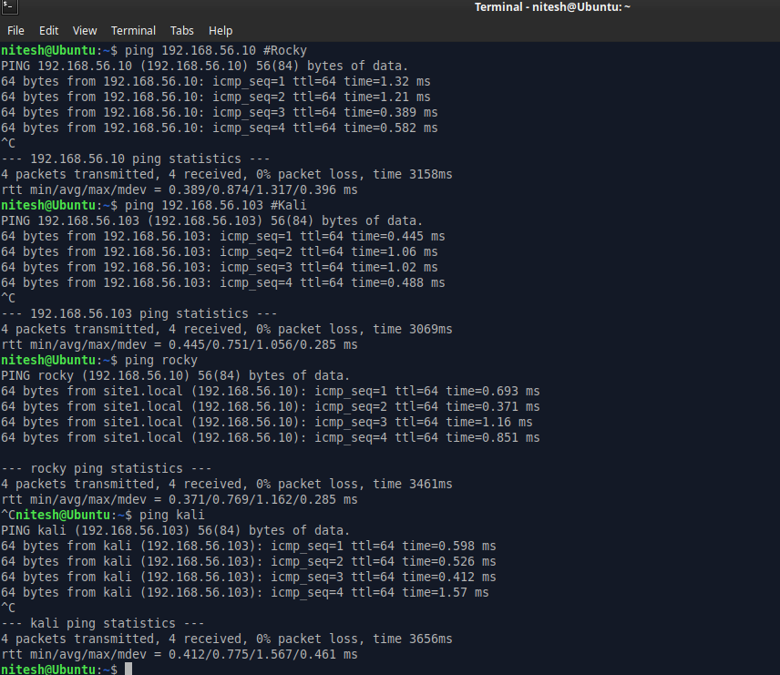
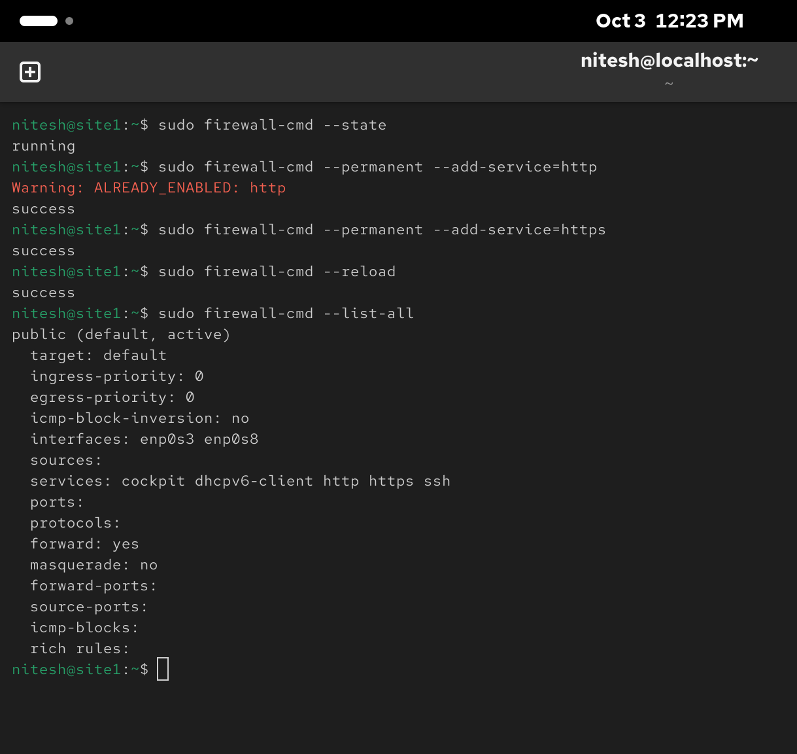

# Linux Networking Lab Setup & Analysis

This repository documents the setup and initial analysis of a virtual lab environment created in VirtualBox. The lab is designed for practicing network reconnaissance, service enumeration, and firewall configuration analysis within a Linux-based environment.

---

## Lab Architecture

The lab consists of three virtual machines operating on a private, internal network, with an additional adapter for external internet access.

### Virtual Machines

| Virtual Machine | Operating System | Role |
| :--- | :--- | :--- |
| **site1** | Rocky Linux 10.0 | Web Server |
| **(Unnamed)** | Ubuntu LTS | Network Client |
| **kali** | Kali Linux | Attacker/Analyst |

### Network Configuration

Each VM is configured with two network adapters to simulate a realistic environment:
* **Adapter 1 (NAT):** Provides outbound internet access for updates and package installation.
* **Adapter 2 (Host-Only):** Creates an internal private network (`192.168.56.0/24`) for inter-VM communication, isolating the lab from the host's primary network.

---

## 1. IP & Hostname Configuration

The IP address of each virtual machine on the host-only network was confirmed using the `ip a` command.

|  |  |  |
| :---: | :---: | :---: |
| _Rocky VM IP Configuration_ | _Ubuntu VM IP Configuration_ | _Kali VM IP Configuration_ |

The following IP addresses were confirmed for this lab:

| IP Address | Hostname(s) | Assigned VM |
| :--- | :--- | :--- |
| `192.168.56.10` | `site1.local`, `rocky` | Rocky Linux |
| `192.168.56.11` | `ubuntu` | Ubuntu LTS |
| `192.168.56.103`| `kali` | Kali Linux |

To facilitate easy access by name, hostnames were mapped in the `/etc/hosts` file on each Linux VM, as well as on the host machine.

---

## 2. Full Network Connectivity Verification

To validate the network configuration, a full set of connectivity tests was performed. Each VM successfully pinged every other VM in the lab, confirming that ICMP traffic and hostname resolution are working correctly across the entire private network.

|  |  |  |
| :---: | :---: | :---: |
| _Connectivity tests from the Kali VM._ | _Connectivity tests from the Rocky VM._ | _Connectivity tests from the Ubuntu VM._ |

Following these direct tests, an Nmap host discovery scan was also run from the Kali machine, which successfully identified all hosts on the network.

---

## 3. Firewall Configuration (Rocky Linux Server)

The firewall on the Rocky Linux web server (`192.168.56.10`) was inspected to understand its security posture.

* **Status:** `running`
* **Allowed Services:** `cockpit`, `dhcpv6-client`, `http`, `https`, `ssh`.

The configuration confirms that SSH and HTTP traffic are explicitly permitted, which aligns with the services we expect to find.


_Image: `firewall-cmd --list-all` output on the Rocky Linux server._

---

## 4. Service Enumeration & Nmap Scans

With connectivity confirmed, a series of Nmap scans were conducted from the Kali machine against the web server (`192.168.56.10`) to identify running services.

### Quick Scan (Common Ports)

```bash
sudo nmap -sS -p 22,80,443 -sV 192.168.56.10 -oN rocky_ssh_http.txt
````

### Comprehensive Scan (Top 1000 Ports)

```bash
sudo nmap -sS --top-ports 1000 -sV 192.168.56.10 -oN rocky_top_1000.txt
```

### Scan Summary

The scans revealed the following open ports and services on the Rocky Linux server:

| Port | State | Service | Version |
| :--- | :--- | :--- | :--- |
| `22/tcp` | open | ssh | OpenSSH 9.9 |
| `80/tcp` | open | http | Apache httpd 2.4.63 ((Rocky Linux)) |
| `443/tcp` | closed | https | N/A |
| `9090/tcp`| open | zeus-admin? | (Unrecognized HTTP-based service) |

-----

## 5\. Web Server Verification

Finally, the Apache web service was verified by accessing `http://site1.local` from the host machine's browser. The server successfully responded with its test page. Further investigation of the `phpinfo()` files confirms that **PHP 8.3.19** is installed and active, indicating a dynamic web environment.

*Image: Accessing the Apache test page for `site1.local`.*

-----

*For unabridged scan results and original log files, please see the `/scanresults/` and `/LogFiles/` directories.*

```
```
