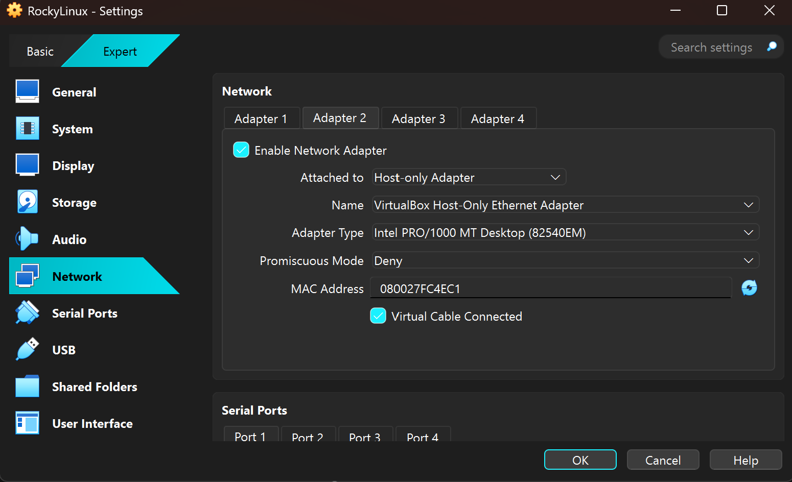
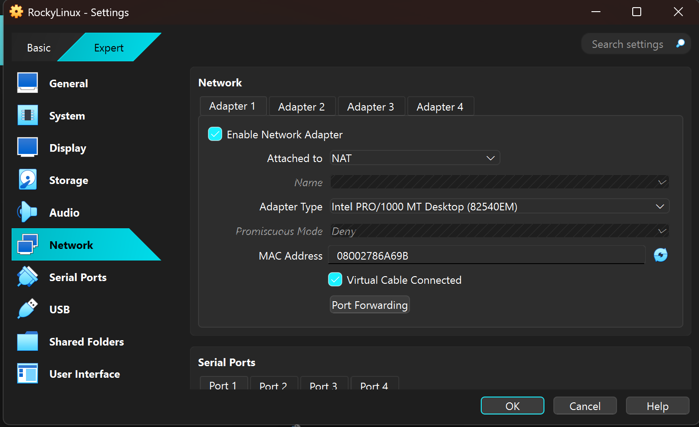
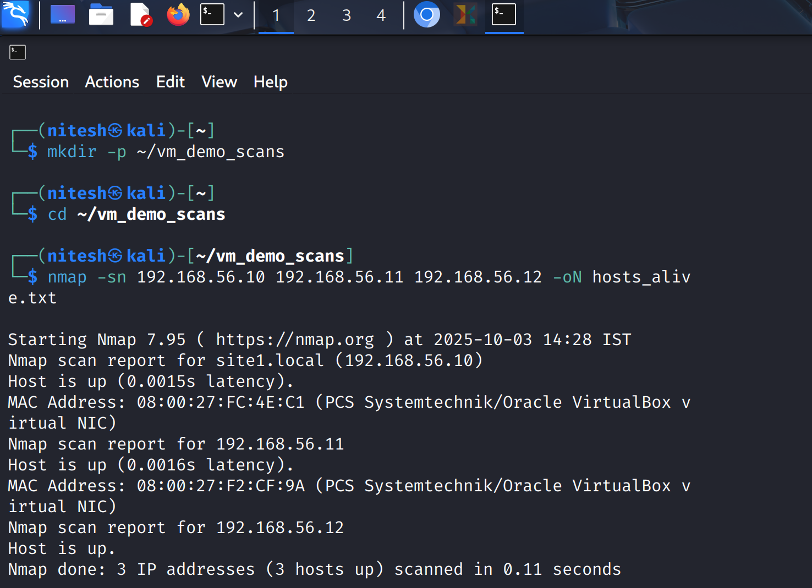
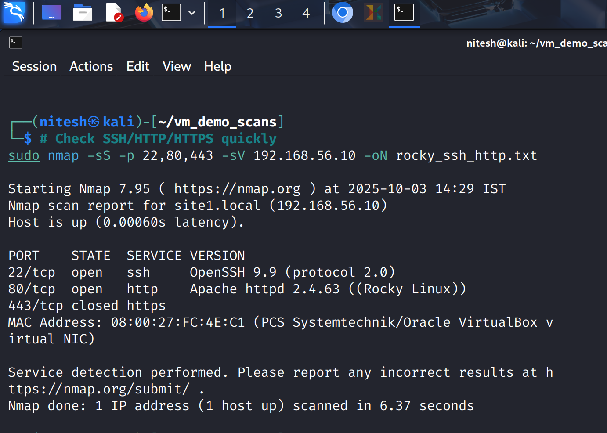
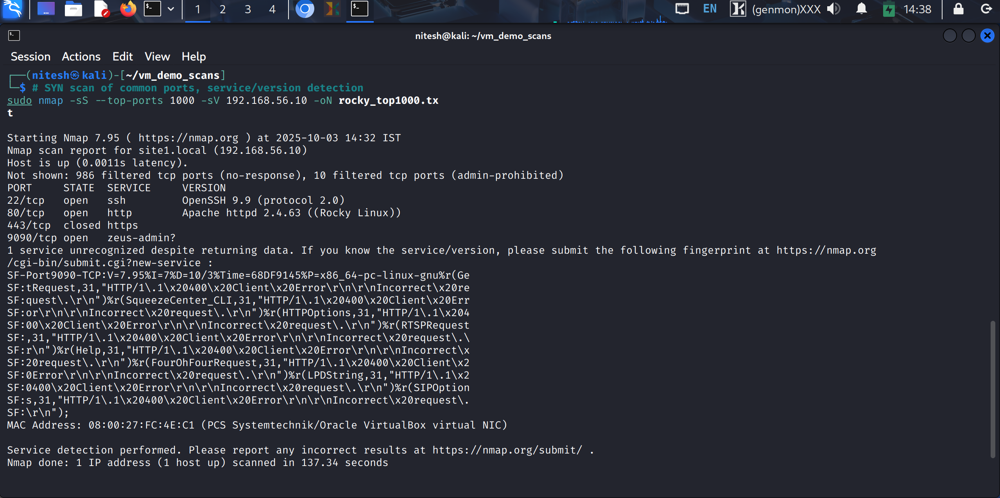
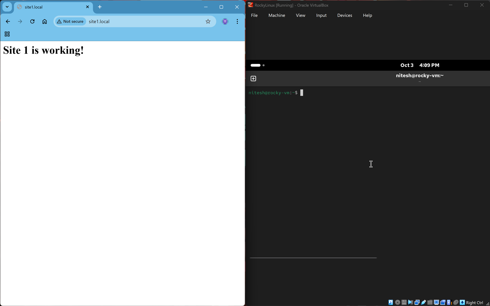

# Linux Networking Lab Setup & Analysis

This repository documents the setup and initial analysis of a virtual lab environment created in VirtualBox. The lab is designed for practicing network reconnaissance, service enumeration, and firewall configuration analysis within a Linux-based environment.

---

## Lab Architecture

The lab consists of three virtual machines operating on a private, internal network, with an additional adapter for external internet access.

### Virtual Machines

| Virtual Machine | Operating System | Role            |
| :-------------- | :--------------- | :-------------- |
| **site1** | Rocky Linux 10.0 | Web Server      |
| **(Unnamed)** | Ubuntu LTS       | Network Client  |
| **kali** | Kali Linux       | Attacker/Analyst |

### Network Configuration

Each VM is configured with two network adapters to simulate a realistic environment:
* **Adapter 1 (NAT):** Provides outbound internet access for updates and package installation.
* **Adapter 2 (Host-Only):** Creates an internal private network (`192.168.56.0/24`) for inter-VM communication, isolating the lab from the host's primary network.


_Image: Rocky Linux VM Host-Only network settings._


_Image: Rocky Linux VM NAT network settings._


## 1. IP & Hostname Configuration

The following static IP addresses were assigned and used for this lab.

| IP Address      | Hostname(s)               | Assigned VM   |
| :-------------- | :------------------------ | :------------ |
| `192.168.56.10` | `site1.local`, `site2.local` | Rocky Linux   |
| `192.168.56.11` | (none)                    | Ubuntu LTS    |
| `192.168.56.12` | (none)                    | Kali Linux    |

To facilitate easy access to the web server, custom hostnames were mapped in the Windows host's `hosts` file.


_Image: Hostname mapping on the Windows host machine._

## 2. Connectivity Verification

An **Nmap ping scan** (`nmap -sn`) was initiated from the Kali Linux machine to confirm that all three VMs were online and reachable on the host-only network.

```bash
nmap -sn 192.168.56.10 192.168.56.11 192.168.56.12 -oN hosts_alive.txt
````

The scan successfully identified all three hosts as being up.



-----

## 3\. Firewall Configuration (Rocky Linux Server)

The firewall on the Rocky Linux web server (`192.168.56.10`) was inspected to understand its security posture.

  * **Status:** `running`
  * **Allowed Services:** `cockpit`, `dhcpv6-client`, `http`, `https`, `ssh`.

The configuration confirms that SSH and HTTP traffic are explicitly permitted, which aligns with the services we expect to find.


## 4\. Service Enumeration & Nmap Scans

With connectivity confirmed, a series of Nmap scans were conducted from the Kali machine against the web server (`192.168.56.10`) to identify running services.

### Quick Scan (Common Ports)

A quick SYN scan targeting key ports (`22`, `80`, `443`) was performed for initial service discovery.

```bash
sudo nmap -sS -p 22,80,443 -sV 192.168.56.10 -oN rocky_ssh_http.txt
```
  


### Comprehensive Scan (Top 1000 Ports)

A more thorough scan targeting the top 1000 TCP ports was run to uncover any other open services.

```bash
sudo nmap -sS --top-ports 1000 -sV 192.168.56.10 -oN rocky_top_1000.txt
```
  

### Scan Summary

The scans revealed the following open ports and services on the Rocky Linux server:

| Port      | State  | Service     | Version                               |
| :-------- | :----- | :---------- | :------------------------------------ |
| `22/tcp`  | open   | ssh         | OpenSSH 9.9                           |
| `80/tcp`  | open   | http        | Apache httpd 2.4.63 ((Rocky Linux))   |
| `443/tcp` | closed | https       | N/A                                   |
| `9090/tcp`| open   | zeus-admin? | (Unrecognized HTTP-based service)     |

-----

## 5\. Web Server Verification

Finally, the Apache web service was verified by accessing `http://site1.local` from the host machine's browser. The server successfully responded with its test page. Further investigation of the `phpinfo()` files confirms that **PHP 8.3.19** is installed and active, indicating a dynamic web environment.

  

```
```
